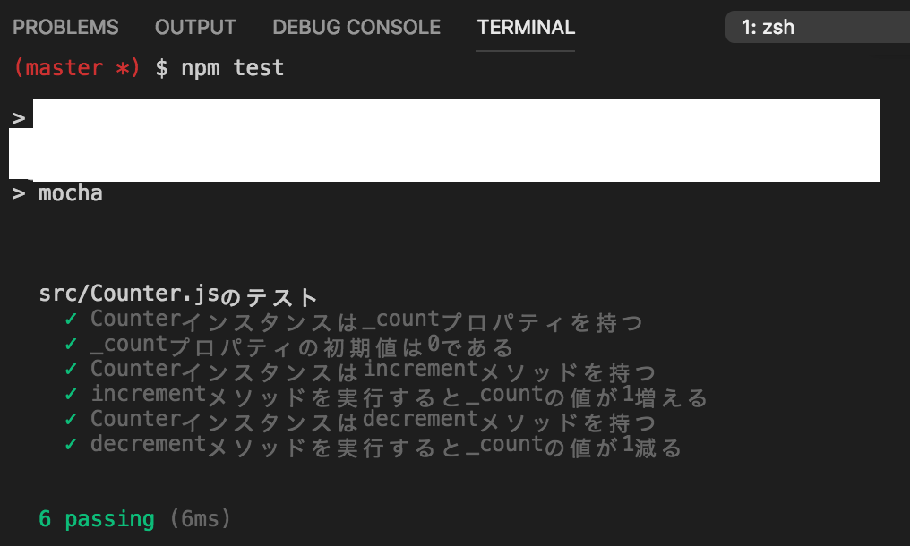

# レポジトリ内容

このレポジトリは[Web白熱教室](https://tsuyopon.xyz/)の[JavaScriptの学習コンテンツ > JavaScriptバックエンド編](https://tsuyopon.xyz/learning-contents/web-dev/javascript/backend/)にある「[【エクササイズ】カウンターの要件定義と機能実装をする](https://tsuyopon.xyz/learning-contents/web-dev/javascript/backend/js-excercise-for-backend-3/)」で利用するものです。

### 完成形

## 課題

- 以下の「課題をクリアするためのステップ」の内容を全て対応する
- 対応後、ターミナルで「npm test」を実行したときに「完成形」と同じものが表示されるようにする

### 課題をクリアするためのステップ

1. [ ] package.jsonを作る
2. [ ] node_modulesをgitのバージョン管理から除外する
3. [ ] テスト用のライブラリとして「[mocha](https://mochajs.org/)」と「[power-assert](https://github.com/power-assert-js/power-assert)」を `devDependencies` にインストールする
4. [ ] package.jsonのscriptsを修正して「npm test」で `mocha` が実行されるようにする
5. [ ] プロジェクトのルートディレクトリ直下にsrcディレクトリを作成して、srcディレクトリの中に「Counter.js」というファイルを作成する
6. [ ]  プロジェクトのルートディレクトリ直下にtestディレクトリを作成する。その後、testディレクトリの中にsrcディレクトリを作成する
7. [ ] testディレクトリの中に [`mocha.opts`](https://mochajs.org/#mochaopts)ファイルを作成して「--recursive」オプションを追加する
    - 参照 :
        - `mocha.opts` について : https://mochajs.org/#mochaopts
        - `--recursive` について : https://mochajs.org/#the-test-directory
8. [ ] 「test/src」ディレクトリの中に「Counter.spec.js」という「src/Counter.js」に対応するテストファイルを作成する
9. [ ] 「test/src/Counter.spec.js」には以下のテストを実装する
    - [ ] Counterクラスは
        - [ ] `_count`プロパティを持つ
        - [ ] `_count`プロパティの初期値は0である
        - [ ] `increment`メソッドを持つ
        - [ ] `increment`メソッドを実行すると`_count`プロパティの値は1増える
        - [ ] `decrement`メソッドを持つ
        - [ ] `decrement`メソッドを実行すると`_count`プロパティの値は1増える
10. [ ] 「npm test」を実行して9で実装したテストが全て失敗することを確認する
11. [ ] 「test/src/Counter.spec.js」のテストが全て成功するように「src/Counter.js」に機能を実装していく

## 答え

このレポジトリの `answer` ブランチに答えを用意しているので、そちらを参考にしていただけたらと思います。

## 参考記事

課題をこなしていて、行き詰まったら以下の資料を参考にしていただければ解答にたどり着けるかと思います。

- Web白熱教室
    - [【Node.JS】テストに必要なライブラリをインストールする](https://tsuyopon.xyz/learning-contents/web-dev/javascript/backend/install-test-libraries-with-npm/)
    - [【Node.JS】テストの書き方・実行方法を覚える【基本型】](https://tsuyopon.xyz/learning-contents/web-dev/javascript/backend/how-to-write-test-code-for-mocha/)
    - [TDD(テスト駆動開発)なスタイルでテストを書く](https://tsuyopon.xyz/learning-contents/web-dev/javascript/backend/write-test-code-in-tdd/)
